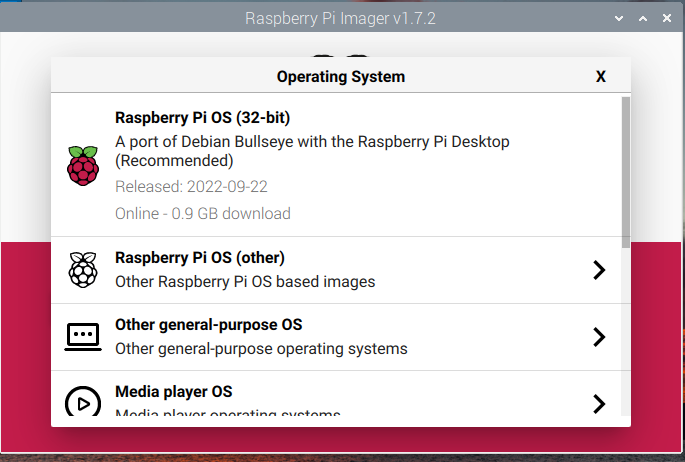
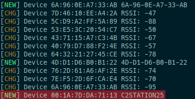
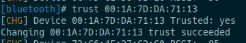
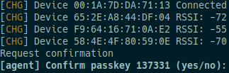
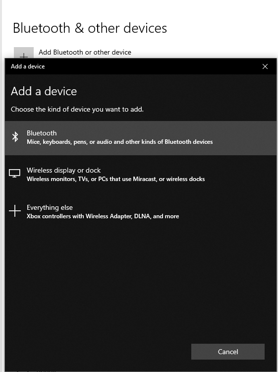
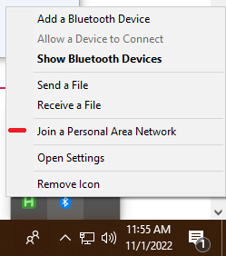
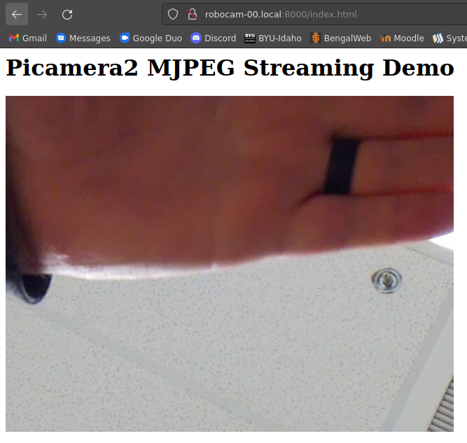

---
title: MCE 6699 Camera Project Notes
author: Nolan Chandler
date: Fall 2022

documentclass: report

geometry:
- margin=1in

linestretch: 1.15

colorlinks: true
linksasnotes: true

toc: true
lot: true
lof: true
...

\clearpage

# Transmittal Letter

TODO

# Summary

## End goal

The goal of the project is to spec out and configure a multi-camera system
that lends itself to be easily mounted near to or onto the end effector
of a robot. The camera streams need to be available for post-processing, such as for
computer vision applications, like motion detection and object identification.
Motion detection can be used to help identify people inside of the robot's workspace
and stop the robot's movement, adding an extra layer of safety.
The camera system can also allow a user to remotely operate the robot by viewing the
streams on another device.

# Raspberry Pi Zero Camera

## Description

The initial configuration to test and validate for this project included a Raspberry Pi
Zero W and a Raspberry Pi Camera Module v2. These parts are readily available and
relatively affordable, and provided a basis for further exploration of the concepts and
configuration that would be needed in the end product.

Table: Raspberry Pi Camera Setup

Hardware                                                                                                      Price (MSRP)
---------                                                                                                     -------------
[Raspberry Pi Zero W](https://www.raspberrypi.com/products/raspberry-pi-zero-w/)                              $10.00
[Raspberry Pi Camera Module v2](https://www.raspberrypi.com/products/camera-module-v2/)                       $25.00 ea.
[Arducam Multi Camera Adapter](https://www.amazon.com/Arducam-Camera-Adapter-Raspberry-Cameras/dp/B07TYL36MC) $50.00

## Current configuration

### Note

All the files mentioned in these instructions can be found on the author's personal
GitHub account in a public repo, linked here:

<https://github.com/ncchandler42/mce6699_camera>

`root` account is disabled. Use `sudo` to run administrative tasks.

- Username: `pi`
- Password: `idahostateMCE`
- IP: `10.42.0.1` on WiFi, `10.43.0.1` on Bluetooth

## Initial configuration

All of the following configurations assume a freshly flashed Raspberry Pi OS
"Bullseye" image. In order to prepare a micro SD card to be used as the storage
drive for the Raspberry Pi Zero W, this image must be downloaded and written to
the card. There are many methods to do this, but the simplest is using the software
provided by the Raspberry Pi Foundation, Raspberry Pi Imager. This software is
available for Windows, macOS and Linux machines, and can be found on the Raspberry
Pi Foundation's website linked here:

<https://www.raspberrypi.com/software/>



The image used for testing this possible camera configuration is the standard
32-bit Raspberry Pi OS.

Once the image has been flashed, boot the Pi with the SD card inserted. On newer
images, you may be greeted with a setup screen that will allow some initial configuration
of the Linux system. All of these parameters can be changed later.

Once booted and greeted with the desktop interface, open the terminal and enter
the command:
```
sudo raspi-config
```
The following configurations will be done using this tool.


### Change hostname

The system's hostname is a designation or alias that the Raspberry Pi will broadcast
over the network to other machines, and provides a way to identify it remotely
without prior knowledge of the Pi's IP address or other information. This is best
chosen to be something unique and easily recognizable. Navigate `raspi-config`'s
menu as follows:

1. System Options $\rightarrow$ S4 Hostname
    - change from "raspberry" to whatever is desired, this project uses the hostname
      "robocam-00"
    - The default user's password can be changed from here too, if needed.

### Boot to command line instead of graphical desktop

In order to free up system resources, the graphical desktop can be disabled and
the Pi will instead boot to a command line. This is desirable for the Raspberry Pi
Zero W, since it only has 512MB RAM and the desktop uses a fair amount of this
memory, even if it is not being used. Navigate the menu as follows:

1. System Options $\rightarrow$ S5 Boot / Auto Login
    - Select `Console Autologin`, this automatically logs in the default user
      `pi`, which is necessary for some of the later configurations.
    - The desktop session can be started anytime with the command `startx`

### Enable SSH

SSH (Secure SHell) provides a way to access the Pi's command line remotely over
the network from other devices.

3. Interface Options $\rightarrow$ I2 SSH
    - Enable. This allows remote logins while connected to Pi's network

While connected to the Pi with any well-configured network, a tool like PuTTY
can reach the Pi by its hostname, in the domain `.local`. Otherwise, it can be
reached by either of its static IP addresses, which are configured later in this
document.

```bash
ssh pi@robocam-00.local
ssh pi@10.42.0.1 # only on wifi
ssh pi@10.43.0.1 # only on BT
```

### Enable Glamor Acceleration

This is a legacy option for older Raspberry Pi models, which will allow its processor
to use hardware acceleration to render camera streams on the Pi's local display.
Without this option enabled, attempting to view a camera stream will consume
system resources heavily and essentially crash or lock up the user interface.

6. Advanced Options $\rightarrow$ A8 Glamor
    - Enable

### Enable Network Manager

Older versions of the Raspberry Pi OS used "dhcpd" to handle configuring network
connections. While still fully functional, "NetworkManager" provides a much more
extensible interface, and allows for much simpler configuration of more complicated
network setups, such as the ones in this document. NetworkManager will soon be
enabled by default for Raspberry Pi OS, but is not at the time of writing and needs
to be manually enabled.

6. Advanced Options $\rightarrow$ AA Network Config
    - If NetworkManager is not available, close `raspi-config` and return to the
      command line. Install it with `sudo apt install networkmanager`, then reopen
      `raspi-config`.

## Wifi Network Host

One of the goals of this project is to be able to view a camera stream remotely
on a different device, such as a laptop or smartphone. This can be done easily
by connecting the device to the same wireless network as the Pi, however, this
approach necessitates another device to host the network such as a wireless router,
and complicates the camera system's mobility. The solution tested was to have
the Pi broadcast and host its own network to which devices can connect to view
the stream.

In the in included folder "wifi-cfg", there are a couple of files including a setup.txt
explaining some installation steps. More importantly, there is a '.nmconnection'
file. This is a text file containing the configuration for creating a WiFi hotspot.
It can be opened with a text editor to edit its values, then copied into the Pi's
configuration directory.

The current configuration is:

- SSID: `robocam-00`
- PSK (passphrase): `idahostateMCE`

Under the block `[ipv4]`, you may also want to configure the Pi's static IP address
on this network. The current configuration sets up the Pi as `10.42.0.1`, but different
subnets can be chosen if desired.

Once edited, the connection profile should be copied into NetworkManager's directory and
given the proper, restricted permissions by running these commands:

```bash
sudo cp robocam-00.nmconnection /etc/NetworkManager/system-connections/
sudo chmod 600 /etc/NetworkManager/system-connections/robocam-00.nmconnection
```

After a reboot, the network will start automatically.

## Bluetooth Network Host (PAN)

Another possible solution that would allow devices to connect to the Pi and view
camera streams is through Bluetooth. Compared with WiFi, the Bluetooth protocol
is shorter-ranged and less subject to interference from competing signals on the
same frequencies. Bluetooth connections require both devices be aware of each other
and be "paired" together before the connection can be used.

In `/etc/bluetooth/main.conf`, find and uncomment (remove the `#` character) the line:
```
#DiscoverableTimeout = 0
```
This sets the Pi's Bluetooth to always be discoverable to devices around it.

### btpan-cfg

There are a number of files that need to be placed in different locations in the
Pi's filesystem to automatically start and manage a bluetooth network. A "makefile"
is provided in the folder as a templated list of each of these files and their destinations,
although some may change based on the available version of Python, for example.

```makefile
install:
    sudo cp ./pan0.nmconnection /etc/NetworkManager/system-connections/
    sudo chmod 600 /etc/NetworkManager/system-connections/pan0.nmconnection
    sudo cp ./btpan /usr/local/sbin/
    sudo cp ./bluezutils.py /usr/local/lib/python3.9/dist-packages
    sudo cp ./btpan.service /etc/systemd/system/
    sudo systemctl enable btpan.service
    sudo chmod +x /usr/local/sbin/btpan
```

If the destinations exist, the makefile can be used as an installation script
simply by issuing the command `make`. This will move the scripts to those locations
and enable a system-controlled service to handle adding and removing clients to
the network. Once installed and operational, the network can be stopped at anytime
using `systemctl`:

```
# Stop the BT network:
sudo systemctl stop btpan.service

# Check if the network service is running:
sudo systemctl status btpan.service

# Disable the BT network (will not start on boot)
sudo systemctl disable btpan.service
```

As with the WiFi network configuration, a static address can be configured for the Pi
on this network, located in the file `pan0.nmconnection`. Currently the Pi is set up
as `10.43.0.1` so as to not conflict with the WiFi network. The other scripts rely
on the existing configuration in this file, so other changes (such as the name of
the bridge interface, "pan0") must be reflected in the other files.

As previously mentioned, to use the Bluetooth network, a device must first be paired to the Pi.
The process differs for different devices, but all pairing must be accepted manually
from the Pi. The instructions to do so are below, as well as screenshots taken
on a Windows machine with a Bluetooth USB adapter, displaying itself as "C2STATION25"

1. Start `bluetoothctl`. This will start a command line interface to the bluetooth
   hardware on the Pi.

2. Make your own device discoverable. This will vary on different platforms.

3. On the Pi, issue the command `scan on`. This will begin a search that will eventually find
   your device and display some information about it, such as its hostname and its MAC address.
    - Once identified, end the scan with `scan off` to prevent the window from filling
      with clutter from other Bluetooth devices.

4. Establish trust using the command `trust [MAC_ADDRESS]`, substituting
    your own MAC (hint: start typing the address and press Tab to autocomplete). This will
    prevent having to manually authorize connection attempts from your device. Once this
    is done, your device no longer needs to be discoverable.

5. On your own device, search for the Pi (it will broadcast itself as its hostname),
    and issue a pairing request (may vary)

6. On the Pi, *quickly* accept the pairing request, verifying any codes it presents.
    - Your own device might ask for confirmation; be sure to accept these as well.

7. Once paired and connected, follow your system's directions for connecting to a
    Bluetooth Personal Area Network (PAN).

After pairing, this process will not need to be repeated to reestablish the connection
with the Pi.

This network connection provides the same functionality as a WiFi connection, with
different caveats such as a much smaller data bandwidth, but decreased power consumption.












## USB Ethernet Connection

With the Pi acting as a network host on both WiFi and Bluetooth, it became important
to be able to provide internet access to the Pi to update to run updates and
retrieve tools. The Pi 0 is able to connect directly to a computer using a micro-USB to USB-A
cable connected to its USB port (not power port) and establish a network with that
computer as if an ethernet cable was connected.

This method was used to share a laptop's wireless connection to the school's network
without needing to disable the Pi's managed networks.

Only a few configuration changes are required to enable this interface:

1. `/boot/config.txt`
    - Add a line reading `dtoverlay=dwc2` at the bottom, under the `[all]` block.

2. `/boot/cmdline.txt`
    - On the same line and following `rootwait`, add the argument `modules-load=dwc2,g_ether`

3. NetworkManager configuration
    - Copy the included configuration to NM's directory:
```bash
    sudo cp EthernetGadget.nmconnection /etc/NetworkManager/system-connections/
    sudo chmod 600 /etc/NetworkManager/system-connections/EthernetGadget.nmconnection
```

4. `/etc/rc.local`
    1. Add the following line to the file, before `exit 0`:
```bash
    $(nmcli c up EthernetGadget &>/dev/null) &
```

5. Reboot to enable changes

Once the Pi has been set up, your connected device will need to be configured to
share its internet connection over the new "Ethernet" interface. This process will
vary based on your system. The following link shows instructions that will probably
work on Windows 10/11:

<https://www.tomshardware.com/how-to/share-internet-connection-windows-ethernet-wi-fi>

## Camera setup

### A quick note

The Raspberry Pi camera is well-documented, and all of the following information
can be found in the official documentation:

<https://www.raspberrypi.com/documentation/accessories/camera.html>

### `libcamera` installation

Up to date Raspberry Pi images are no longer using the `Raspicam` libraries that
have been around for some time, and have instead switched to a more cross-compatible library,
`libcamera`. It is included on newer Pi images, but if not can be installed using `apt`:
```bash
sudo apt install libcamera-apps
```

### `libcamera` test

A simple test can be run using `libcamera-hello`. This will open a preview
window of what the camera sees. This test can help diagnose connection issues
between the Pi and the camera module, as it prints out some diagnostic information
about the detected sensor.


### `picamera2`

`picamera2` is the Raspberry Pi foundation's newest user-friendly Python API
for camera functions. It is installed by default on new images, but can be installed
manually:
```bash
sudo apt install python3-picamera2
```

The entire project is very well-documented and easy to use. The official documentation
detailing its usage can be found on the official Raspberry Pi website:

<https://datasheets.raspberrypi.com/camera/picamera2-manual.pdf>

### Simple Web Server

For testing purposes, I wanted to setup the Pi to host an HTTP server/webpage
displaying the camera's view, so that any network connected device would be able
to view the stream. Thankfully, the authors of `picamera2` wrote an example script,
`mjpeg_server.py`, that does exactly this.

The easiest way to obtain this script is by cloning the `picamera2` GitHub repo.
```bash
sudo apt install git
git clone https://github.com/raspberrypi/picamera2
cd picamera2/examples
```
Once the script has been cloned, it can be run to start the server:
```bash
python3 ./mjpeg_server.py
```

Once this has been started, any network connected device should be able to open
the webpage being served by the Pi using a web-browser and the following URL:

<http://robocam-00.local:8000>

If your device is unable to resolve the hostname (common on Windows, but untested),
either of the Pi's static IP addresses can be substituted for the hostname according
to the network your device is connected to:

- WiFi: <http://10.42.0.1:8000>
- Bluetooth: <http://10.43.0.1:8000>



# Alternate Hardware Considerations

For the motion detection function, a camera with a wide-angle/fish-eye lens will
provide a wider view.

+--------------------------------+--------------+----------------------------------------------+
| Hardware                       | Price (MSRP) | Considerations                               |
+:===============================+:============:+:=============================================+
| NVIDIA Jetson Nano 4GB         | $149.00      | - 2 MIPI CSI-2 connectors, 12 lanes          |
|                                |              |     - Able to run 4 cameras simultaneously   |
|                                |              | - Large list of supported camera sensors     |
|                                |              | - Designed for AI/CV processing applications |
|                                |              | - Relatively high power draw, up to 10W      |
+--------------------------------+--------------+----------------------------------------------+
| M5stack ESP32 Unit Cam DIY Kit | $18.95       | - Inexpensive                                |
|                                |              | - Kit provides OV2640 (2MP) sensor           |
|                                |              |   and wide-angle lens                        |
|                                |              | - Low power                                  |
|                                |              | - Powered by standard LiPo battery,          |
|                                |              |   charging integrated                        |
|                                |              | - Requires other system to process images    |
+--------------------------------+--------------+----------------------------------------------+
| PiHut ZeroCam FishEye          | $14.02       | - 5MP sensor with wide-angle lens            |
|                                |              | - Intended for use with RPi Zero, other Pi   |
|                                |              |   models require an adapter                  |
+--------------------------------+--------------+----------------------------------------------+

Table: Caption
