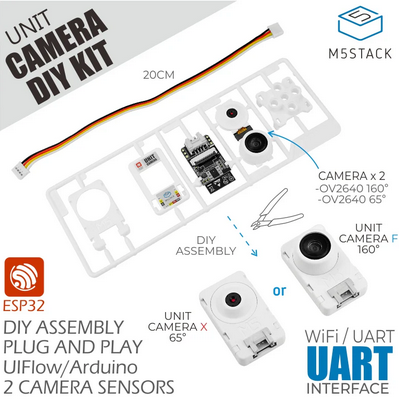
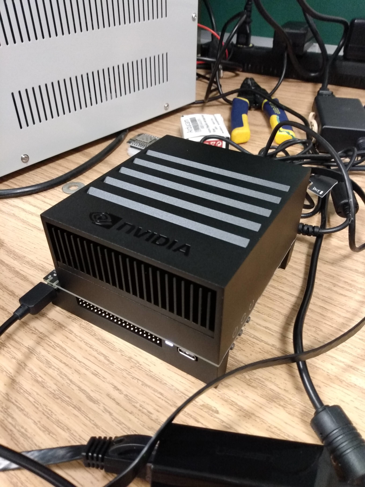
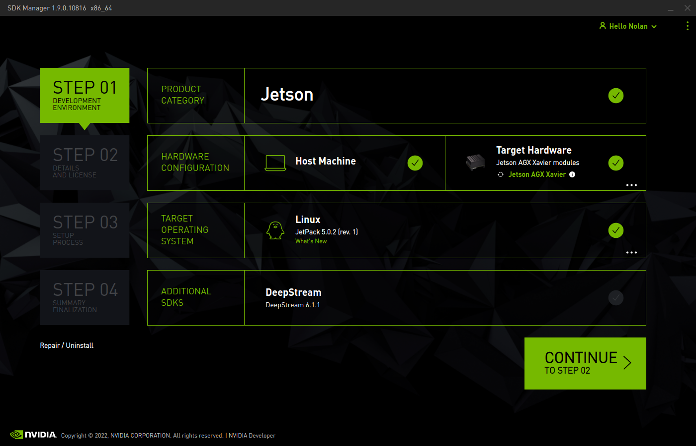
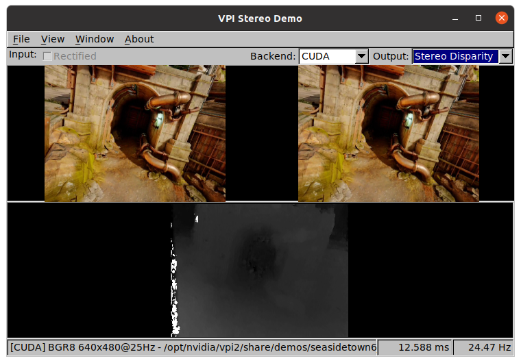
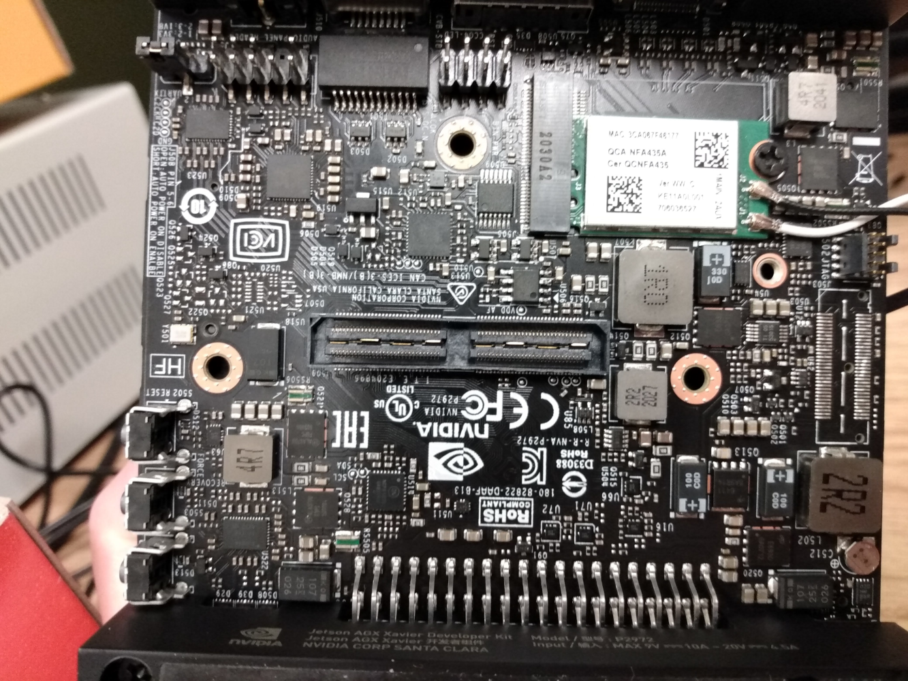

---
title: Modular Camera Array for Robotic Arm
author: Nolan Chandler
date: Fall 2022

documentclass: report

geometry:
- margin=1in

linestretch: 1.15

colorlinks: true
linksasnotes: true

toc: true
lot: true
lof: true
...

\clearpage

# Transmittal Letter

Dearest recipient,

The following report offers instructions for and details about the configuration of
two different systems with the goal of designing and maintaining a modular camera
array for different purposes. The purpose of this writing is to provide a solid
foundation for future work; all included instructions are the result of many hours
of tinkering to see what works, and how complicated it is to set up. Despite my
best efforts, there may still be errors or incompatibilities with the current set
of instructions, and there is, unfortunately, no guarantee the systems configured
within this work will be maintained by their manufacturers.

The greatest effort was made to be as accurate as possible and as verbose as needed.
Notwithstanding these efforts, if any misunderstanding arises, feel free to get in
contact with me to ask any questions.

I hope my work provides what it was intended to as this project and the projects
that will branch from it advance.

Best regards,

Nolan Chandler

`nolanchandler@isu.edu`

# Summary

## End goal

The goal of the project is to spec out and configure a multi-camera system
that lends itself to be easily mounted near to or onto the end effector
of a robot. The camera streams need to be available for post-processing, such as for
computer vision applications, like motion detection and object identification.
Motion detection can be used to help identify people inside of the robot's workspace
and stop the robot's movement, adding an extra layer of safety.
The camera system can also allow a user to remotely operate the robot by viewing the
streams on another device.

# Raspberry Pi Zero Camera

## Description

The initial configuration to test and validate for this project included a Raspberry Pi
Zero W and a Raspberry Pi Camera Module v2. These parts are readily available and
relatively affordable, and provided a basis for further exploration of the concepts and
configuration that would be needed in the end product.

Table: Raspberry Pi Camera Setup

Hardware                                                                                Price (MSRP)
---------                                                                               -------------
[Raspberry Pi Zero W](https://www.raspberrypi.com/products/raspberry-pi-zero-w/)        $10.00
[Raspberry Pi Camera Module v2](https://www.raspberrypi.com/products/camera-module-v2/) $25.00 ea.

## Current configuration

### Note

All the files mentioned in these instructions can be found on the author's personal
GitHub account in a public repository, linked here:

<https://github.com/ncchandler42/mce6699_camera>

`root` account is disabled. Use `sudo` to run administrative tasks.

- Username: `pi`
- Password: `idahostateMCE`
- Hostname: `robocam-00`
- IP: `10.42.0.1` on WiFi, `10.43.0.1` on Bluetooth

## Initial configuration

All of the following configurations assume a freshly flashed Raspberry Pi OS
"Bullseye" image. In order to prepare a micro SD card to be used as the storage
drive for the Raspberry Pi Zero W, this image must be downloaded and written to
the card. There are many methods to do this, but the simplest is using the software
provided by the Raspberry Pi Foundation, Raspberry Pi Imager. This software is
available for Windows, macOS and Linux machines, and can be found on the Raspberry
Pi Foundation's website linked here:

<https://www.raspberrypi.com/software/>


The image used for testing this possible camera configuration is the standard
32-bit Raspberry Pi OS.

Once the image has been flashed, boot the Pi with the SD card inserted. On newer
images, you may be greeted with a setup screen that will allow some initial configuration
of the Linux system. All of these parameters can be changed later.

Once booted and greeted with the desktop interface, open the terminal and enter
the command:
```
sudo raspi-config
```
The following configurations will be done using this tool.


### Change hostname

The system's hostname is a designation or alias that the Raspberry Pi will broadcast
over the network to other machines, and provides a way to identify it remotely
without prior knowledge of the Pi's IP address or other information. This is best
chosen to be something unique and easily recognizable. Navigate `raspi-config`'s
menu as follows:

1. System Options $\rightarrow$ S4 Hostname
    - change from "raspberry" to whatever is desired, this project uses the hostname
      "robocam-00"
    - The default user's password can be changed from here too, if needed.

### Boot to command line instead of graphical desktop

In order to free up system resources, the graphical desktop can be disabled and
the Pi will instead boot to a command line. This is desirable for the Raspberry Pi
Zero W, since it only has 512MB RAM and the desktop uses a fair amount of this
memory, even if it is not being used. Navigate the menu as follows:

1. System Options $\rightarrow$ S5 Boot / Auto Login
    - Select `Console Autologin`, this automatically logs in the default user
      `pi`, which is necessary for some of the later configurations.
    - The desktop session can be started anytime with the command `startx`

### Enable SSH

SSH (Secure SHell) provides a way to access the Pi's command line remotely over
the network from other devices.

3. Interface Options $\rightarrow$ I2 SSH
    - Enable. This allows remote logins while connected to Pi's network

While connected to the Pi with any well-configured network, a tool like PuTTY
can reach the Pi by its hostname, in the domain `.local`. Otherwise, it can be
reached by either of its static IP addresses, which are configured later in this
document.

```bash
ssh pi@robocam-00.local
ssh pi@10.42.0.1 # only on wifi
ssh pi@10.43.0.1 # only on BT
```

### Enable Glamor Acceleration

This is a legacy option for older Raspberry Pi models, which will allow its processor
to use hardware acceleration to render camera streams on the Pi's local display.
Without this option enabled, attempting to view a camera stream will consume
system resources heavily and essentially crash or lock up the user interface.

6. Advanced Options $\rightarrow$ A8 Glamor
    - Enable

### Enable Network Manager

Older versions of the Raspberry Pi OS used "dhcpd" to handle configuring network
connections. While still fully functional, "NetworkManager" provides a much more
extensible interface, and allows for much simpler configuration of more complicated
network setups, such as the ones in this document. NetworkManager will soon be
enabled by default for Raspberry Pi OS, but is not at the time of writing and needs
to be manually enabled.

6. Advanced Options $\rightarrow$ AA Network Config
    - If NetworkManager is not available, close `raspi-config` and return to the
      command line. Install it with `sudo apt install networkmanager`, then reopen
      `raspi-config`.

## Wifi Network Host

One of the goals of this project is to be able to view a camera stream remotely
on a different device, such as a laptop or smartphone. This can be done easily
by connecting the device to the same wireless network as the Pi, however, this
approach necessitates another device to host the network such as a wireless router,
and complicates the camera system's mobility. The solution tested was to have
the Pi broadcast and host its own network to which devices can connect to view
the stream.

In the in included folder "wifi-cfg", there are a couple of files including a setup.txt
explaining some installation steps. More importantly, there is a '.nmconnection'
file. This is a text file containing the configuration for creating a WiFi hotspot.
It can be opened with a text editor to edit its values, then copied into the Pi's
configuration directory.

The current configuration is:

- SSID: `robocam-00`
- PSK (passphrase): `idahostateMCE`

Under the block `[ipv4]`, you may also want to configure the Pi's static IP address
on this network. The current configuration sets up the Pi as `10.42.0.1`, but different
subnets can be chosen if desired.

Once edited, the connection profile should be copied into NetworkManager's directory and
given the proper, restricted permissions by running these commands:

```bash
sudo cp robocam-00.nmconnection /etc/NetworkManager/system-connections/
sudo chmod 600 /etc/NetworkManager/system-connections/robocam-00.nmconnection
```

After a reboot, the network will start automatically.

## Bluetooth Network Host (PAN)

Another possible solution that would allow devices to connect to the Pi and view
camera streams is through Bluetooth. Compared with WiFi, the Bluetooth protocol
is shorter-ranged and less subject to interference from competing signals on the
same frequencies. Bluetooth connections require both devices be aware of each other
and be "paired" together before the connection can be used.

In `/etc/bluetooth/main.conf`, find and uncomment (remove the `#` character) the line:
```
#DiscoverableTimeout = 0
```
This sets the Pi's Bluetooth to always be discoverable to devices around it.

### btpan-cfg

There are a number of files that need to be placed in different locations in the
Pi's filesystem to automatically start and manage a bluetooth network. A "makefile"
is provided in the folder as a templated list of each of these files and their destinations,
although some may change based on the available version of Python, for example.

```makefile
install:
    sudo cp ./pan0.nmconnection /etc/NetworkManager/system-connections/
    sudo chmod 600 /etc/NetworkManager/system-connections/pan0.nmconnection
    sudo cp ./btpan /usr/local/sbin/
    sudo cp ./bluezutils.py /usr/local/lib/python3.9/dist-packages
    sudo cp ./btpan.service /etc/systemd/system/
    sudo systemctl enable btpan.service
    sudo chmod +x /usr/local/sbin/btpan
```

If the destinations exist, the makefile can be used as an installation script
simply by issuing the command `make`. This will move the scripts to those locations
and enable a system-controlled service to handle adding and removing clients to
the network. Once installed and operational, the network can be stopped at anytime
using `systemctl`:

```
# Stop the BT network:
sudo systemctl stop btpan.service

# Check if the network service is running:
sudo systemctl status btpan.service

# Disable the BT network (will not start on boot)
sudo systemctl disable btpan.service
```

As with the WiFi network configuration, a static address can be configured for the Pi
on this network, located in the file `pan0.nmconnection`. Currently the Pi is set up
as `10.43.0.1` so as to not conflict with the WiFi network. The other scripts rely
on the existing configuration in this file, so other changes (such as the name of
the bridge interface, "pan0") must be reflected in the other files.

As previously mentioned, to use the Bluetooth network, a device must first be paired to the Pi.
The process differs for different devices, but all pairing must be accepted manually
from the Pi. The instructions to do so are below, as well as screenshots taken
on a Windows machine with a Bluetooth USB adapter, displaying itself as "C2STATION25"

1. Start `bluetoothctl`. This will start a command line interface to the bluetooth
   hardware on the Pi.

2. Make your own device discoverable. This will vary on different platforms.

3. On the Pi, issue the command `scan on`. This will begin a search that will eventually find
   your device and display some information about it, such as its hostname and its MAC address.
    - Once identified, end the scan with `scan off` to prevent the window from filling
      with clutter from other Bluetooth devices.

4. Establish trust using the command `trust [MAC_ADDRESS]`, substituting
    your own MAC (hint: start typing the address and press Tab to autocomplete). This will
    prevent having to manually authorize connection attempts from your device. Once this
    is done, your device no longer needs to be discoverable.

5. On your own device, search for the Pi (it will broadcast itself as its hostname),
    and issue a pairing request (may vary)

6. On the Pi, *quickly* accept the pairing request, verifying any codes it presents.
    - Your own device might ask for confirmation; be sure to accept these as well.

7. Once paired and connected, follow your system's directions for connecting to a
    Bluetooth Personal Area Network (PAN).

After pairing, this process will not need to be repeated to reestablish the connection
with the Pi.

This network connection provides the same functionality as a WiFi connection, with
different caveats such as a much smaller data bandwidth, but decreased power consumption.


## USB Ethernet Connection

With the Pi acting as a network host on both WiFi and Bluetooth, it became important
to be able to provide internet access to the Pi to update to run updates and
retrieve tools. The Pi 0 is able to connect directly to a computer using a micro-USB to USB-A
cable connected to its USB port (not power port) and establish a network with that
computer as if an ethernet cable was connected.

This method was used to share a laptop's wireless connection to the school's network
without needing to disable the Pi's managed networks.

Only a few configuration changes are required to enable this interface:

1. `/boot/config.txt`
    - Add a line reading `dtoverlay=dwc2` at the bottom, under the `[all]` block.

2. `/boot/cmdline.txt`
    - On the same line and following `rootwait`, add the argument `modules-load=dwc2,g_ether`

3. NetworkManager configuration
    - Copy the included configuration to NM's directory:
```bash
    sudo cp EthernetGadget.nmconnection /etc/NetworkManager/system-connections/
    sudo chmod 600 /etc/NetworkManager/system-connections/EthernetGadget.nmconnection
```

4. `/etc/rc.local`
    1. Add the following line to the file, before `exit 0`:
```bash
    $(nmcli c up EthernetGadget &>/dev/null) &
```

5. Reboot to enable changes

Once the Pi has been set up, your connected device will need to be configured to
share its internet connection over the new "Ethernet" interface. This process will
vary based on your system. The following link shows instructions that will probably
work on Windows 10/11:

<https://www.tomshardware.com/how-to/share-internet-connection-windows-ethernet-wi-fi>

## Camera setup

### A quick note

The Raspberry Pi camera is well-documented, and all of the following information
can be found in the official documentation:

<https://www.raspberrypi.com/documentation/accessories/camera.html>

### `libcamera` installation

Up to date Raspberry Pi images are no longer using the `Raspicam` libraries that
have been around for some time, and have instead switched to a more cross-compatible library,
`libcamera`. It is included on newer Pi images, but if not can be installed using `apt`:
```bash
sudo apt install libcamera-apps
```

### `libcamera` test

A simple test can be run using `libcamera-hello`. This will open a preview
window of what the camera sees. This test can help diagnose connection issues
between the Pi and the camera module, as it prints out some diagnostic information
about the detected sensor.


### `picamera2`

`picamera2` is the Raspberry Pi foundation's newest user-friendly Python API
for camera functions. It is installed by default on new images, but can be installed
manually:
```bash
sudo apt install python3-picamera2
```

The entire project is very well-documented and easy to use. The official documentation
detailing its usage can be found on the official Raspberry Pi website:

<https://datasheets.raspberrypi.com/camera/picamera2-manual.pdf>

### Simple Web Server

For testing purposes, I wanted to setup the Pi to host an HTTP server/webpage
displaying the camera's view, so that any network connected device would be able
to view the stream. Thankfully, the authors of `picamera2` wrote an example script,
`mjpeg_server.py`, that does exactly this.

The easiest way to obtain this script is by cloning the `picamera2` GitHub repo.
```bash
sudo apt install git
git clone https://github.com/raspberrypi/picamera2
cd picamera2/examples
```
Once the script has been cloned, it can be run to start the server:
```bash
python3 ./mjpeg_server.py
```

Once this has been started, any network connected device should be able to open
the webpage being served by the Pi using a web-browser and the following URL:

<http://robocam-00.local:8000>

If your device is unable to resolve the hostname (common on Windows, but untested),
either of the Pi's static IP addresses can be substituted for the hostname according
to the network your device is connected to:

- WiFi: <http://10.42.0.1:8000>
- Bluetooth: <http://10.43.0.1:8000>


## Results

As these final tests were conducted, it became apparent that the Raspberry Pi
Zero W would not be sufficient for our applications. The Pi is able to run a
single camera video stream, but at a low frame rate due to its limited processing
power. In these tests, the camera stream was updated at only 10 frames per second.
The intended use cases require a higher frame rate. To provide a smooth experience
to a remote operator, a target frame rate of 30 frames per second was estimated.
Additionally, for motion detection and object avoidance, extra processing power
is required to process the frames as they are collected from the sensor.

# Alternate Hardware Considerations

For the motion detection function, a camera with a wide-angle/fish-eye lens will
provide a wider view. Additionally, a board built for image acquisition and processing
would better suit the performance requirements of the project.

+--------------------------------+--------------+----------------------------------------------+
| Hardware                       | Price (MSRP) | Considerations                               |
+:===============================+:============:+:=============================================+
| M5stack ESP32 Unit Cam DIY Kit | $18.95       | - Inexpensive                                |
|                                |              | - Kit provides OV2640 (2MP) sensor           |
|                                |              |   and wide-angle lens                        |
|                                |              | - Low power                                  |
|                                |              | - Powered by standard LiPo battery,          |
|                                |              |   charging integrated                        |
|                                |              | - Requires other system to process images    |
+--------------------------------+--------------+----------------------------------------------+
| NVIDIA Jetson Nano 4GB         | $149.00      | - 2 MIPI CSI-2 connectors, 12 lanes          |
|                                |              |     - Able to run 4 cameras simultaneously   |
|                                |              | - Large list of supported camera sensors     |
|                                |              | - Designed for AI/CV processing applications |
|                                |              | - Relatively high power draw, up to 10W      |
+--------------------------------+--------------+----------------------------------------------+

Table: Caption

## M5Stack ESP32 WiFi camera

The M5Stack ESP32 camera is a small, self-contained camera system. It is powered
by a standard LiPo battery, and comes with a $160^{\circ}$ wide-angle lens. The
microcontroller that runs the camera is an ESP32, which is an MCU with strong
performance and built-in WiFi capabilities. The intention behind finding a camera
system like this one is to offload the work of receiving the image from the camera
sensor from the processor of a host board like the Pi, and instead create a
wireless array of cameras that can operate independently from the host board.

Due to the necessity of a powerful host board in the first place, this option was
eventually dropped in favor of a simpler system with a single board that manages
its own cameras.



## NVIDIA Jetson Nano 4GB

NVIDIA's Jetson line of single-board computers are purpose-built for image processing
and artificial intelligence workloads, and are abundant in the industries requiring
power and small form-factor. The Jetson Nano is one of the more modestly priced
boards available from NVIDIA, being aimed at not only industries, but hobbyists.
The system module has the required camera lanes available to run 4 cameras simultaneously
although the developer kit only breaks these lanes out into 2 MIPI camera ports.
To run more cameras, a custom carrier board for the module would need to be sourced.

This option was dropped simply because at the time of writing, these boards are
unavailable from any retailers at acceptable prices.

## NVIDIA Jetson AGX Xavier

What the Jetson Nano has going for it, the AGX Xavier has, and more. It is one of
NVIDIA's more powerful modules for image processing, and is able to run 6 cameras
simultaneously while offering plenty of power for processing the streams in real-time.
While no longer available for purchase from NVIDIA (as they have moved on to their
next generation of boards), this board was previously purchased by a faculty member
and was available to use, at no additional cost to us of funds or time.



# AGX Xavier Setup and Configuration

## Host computer

At the time of writing, NVIDIA requires that their installation tool be run on a Linux computer,
with the supported Linux distributions listed on the its download page.
However, the host tools and the OS image (known together as the Jetpack SDK)
**ONLY** support a few versions of Ubuntu Linux. At the time of writing, to match
compatibility between the current version of the SDKManager program and the Jetpack SDK,
a laptop was set up with Ubuntu 20.04 LTS, with the following configuration:

- Username: `jetson`
- Password: `idahostateMCE`

## Flashing the Operating System

A separate computer is required to retrieve and flash the operating
system image to the board. This is done using NVIDIA's SDKManager tool.

### Installing SDKManager

SDKManager is available on NVIDIA's developer website as a free download, found
at the address below:

<https://developer.nvidia.com/drive/sdk-manager>

In order to access the download, you must create an NVIDIA developer account. This
account information will also be used to login to SDKManager once it is installed.

Once downloaded, the SDKManager can be installed by navigating to the `Downloads`
directory and installing the `.deb` package using `apt`:

```
$ cd Downloads
$ sudo apt install ./sdkmanager-{version}.deb
```

Once installed, SDKManager can be launched from the applications menu. A prompt is
then given to login to an NVIDIA developer account.

### Setting the Jetson board into "Force Recovery Mode"

To flash the operating system onto the Xavier's internal memory, it must first
be booted into "Force Recovery Mode". This is done following these steps:

1. Power off the board, if previously running
2. Connect the power adapter to the rear of the board
3. Connect an HDMI-compatible display to the HDMI port on the rear of the board
4. Connect a keyboard and mouse to the rear USB ports
    - There is only 1 available USB-A port, but the Xavier kit includes a USB-C male
      to USB-A female adapter to make use of the rear USB-C port as well.
5. Connect the Xavier board to the host computer from the front USB-C port using
   the included USB-C male to USB-A male cable
6. Press and hold the Recovery button on the board
    - The button is marked with a small icon of a circle made of two arrows
7. While continuing to hold the Recovery button, press and hold the power button
   until the power LED on the front of the board lights up
8. Release both buttons

You can verify that the board is in the Recovery mode by checking SDKManager;
it will automatically be discovered and identified.

### Downloading and flashing



Verify that the board has been discovered by SDKManager on its main page. From
this page, the desired hardware configuration can be set. By choosing the
host machine as well as the target hardware, useful development tools will be
installed locally by SDKManager. The version of the JetPack SDK can then be
selected, which should be the most recent available version.

If running a Linux distribution or version not supported by the current version
of the JetPack SDK, instead a box to select a version, a greyed out
box with a cryptic message about the OS not being supported will appear. This will
be the case when NVIDIA drops support for Ubuntu 20.04, which will likely happen in
the future, since at the time of writing, a newer Long Term Support (LTS) version of
Ubuntu is already available (22.04 LTS).

After selecting the desired version of JetPack SDK, additional SDKs can be added
to the installation. These SDKs may be of use for future applications, so for the
current configuration, all available SDKs were added.

Once the configuration is as desired, click the "Continue" button to proceed with
the installation. The installer will then download the chosen software components,
including the operating system for the Xavier board. As components finish downloading,
they will be verified and the flashing process will begin.

All throughout the process, several prompts appear, some asking for the host computer's
password to install programs locally. The prompts will pause any ongoing operation
until they are completed; to keep the installation process moving along will require
being present at the computer watching for these prompts.

One of the final prompts will ask about configuring a username and password for
the newly flashed operating system on the Xavier board. As the prompt explains,
this can be done from either the prompt itself or by following the setup instructions
given on the display attached to the Xavier board.

## Current configuration

- Username: `jetson`
- Password: `idahostateMCE`
- Hostname: `agx-xavier`

## Image Processing Demo

Included with the software installed on the operating system image are several
demonstrations. As this project will require using multiple cameras simultaneously,
a demo was found that uses images captured from 2 connected cameras to calculate
stereo depth. The demo also provides example video streams.



Using one of the example video streams, the AGX Xavier was observed being able to
process the images and render the output in real-time, well above an acceptable
frame rate.

# Future Considerations



Due to a misunderstanding on part of the author, it was thought that the AGX Xavier
Developer Kit board had the available CSI-2 ports to connect cameras similar to
(and including) the Raspberry Pi Camera Module v2. It was soon discovered that this
was not the case, and that the AGX Xavier instead breaks out its MIPI camera lanes
using a proprietary connector. In order to connect cameras to the board, an additional
adapter board will need to be purchased. NVIDIA does not manufacture or own a
design for the necessary adapter board, but instead offers the specifications and
pinout of the connector so that users can design an adapter board to their own needs.
Because of this, there are not many available options for purchase.

One available adapter board is offered by an NVIDIA-partnered company named
Leopard Imaging. The adapter is included in a number of different camera kits,
based on the desired camera sensor, and number of included cameras.

The most modest camera module they offer in these kits is the Sony IMX185, which
is capable of a full HD 1080p video stream at 60 frames per second, which meets
the base requirements of the project. The kit, including 3 of these cameras, 3 cables
(30 cm each) and the needed adapter board, is available for \$919.00 at the following
address:

<https://www.leopardimaging.com/product/nvidia-jetson-cameras/nvidia-agx-xavier-camera-kits/li-xavier-kit-imx185cs/li-xavier-kit-imx185m12-t/>

Longer cables, up to 1 m long, can also be purchased from Leopard Imaging as required.

Once the required hardware is obtained, other demos included on the board will
provide a good starting point and reference moving forward, as well as providing
a means to verify the cameras' function and capabilities.

# Appendix

All files used to configure the Raspberry Pi, as well as documentation for the Pi,
its camera libraries, and the Jetson AGX Xavier, can be found on the author's personal
GitHub account via a public repository:

<https://github.com/ncchandler42/mce6699_camera>
